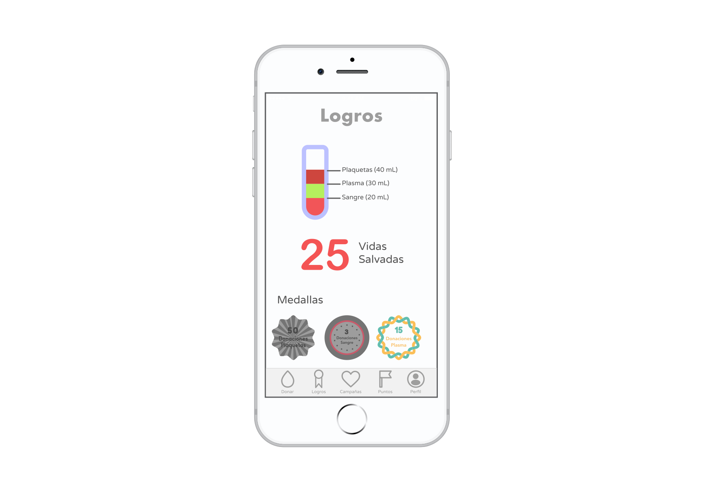
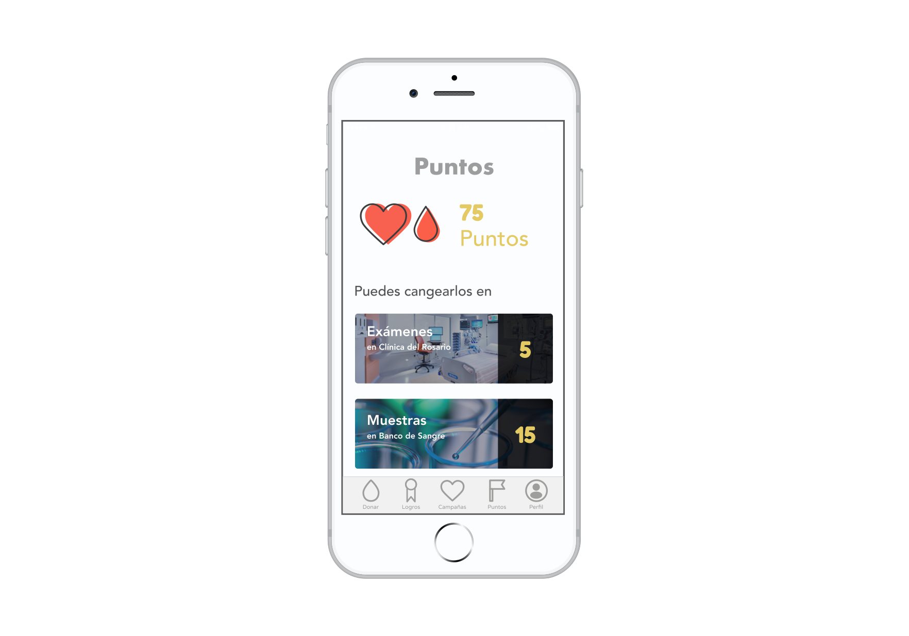

# Bloothers

This web app was presented during the Hackathon AngelHack 2018 in the city of Medellín (Colombia). It was awarded in two categories: _IBM Call for Code_ and _Social Entrepreneurship_. The app provides incentives for blood donation in the form of redeemable points.

Because of the limited amount of time in the competition, this prototype is no fully finished, however, it successfully illustrates the idea.

Here are come mockups of the app:

**Choose what you want to donate**

**Track your achievements as well as how many lives you have saved!**

**See campaigns around you**

**See the points you have earned and what you can redeem them for**

Here’s a tweet from Ruta N featuring our idea at the AngelHack:
[https://twitter.com/ruta\_n/status/1028789416209395712?s=21](https://twitter.com/ruta_n/status/1028789416209395712?s=21)